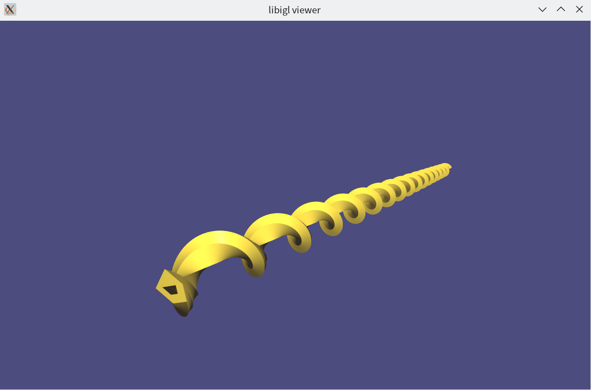

# ZJU-21FA-3D-CAD

浙江大学 2021 年秋季学期《三维CAD建模基础》作业：基于欧拉操作的扫掠体生成。

## 运行环境
仅测试 `ArchLinux`。

## 依赖

* `CMake >= 3.14` 构建工具。
* `GNU GCC >= 11.1` 编译器，`GCC 10.3`应该也可以编译。

以下依赖会在编译时自动从Github下载：

* `Eigen 3.4` 本项目使用的线性代数库。
* `exprtk` 用于解析数学表达式。
* `clip2tri` 用于将面片三角化，以用于后续渲染。
* `libigl` 用于三维模型的渲染。

## 编译方式
1. 配置。
```bash
cmake -S . -B build -DCMAKE_BUILD_TYPE=Release
```
该步进行时，将会自动从Github下载上述依赖。若你的网络状况不佳，此步可能会遭遇失败。此种情形下，建议使用`proxychains`，以代理方式执行该命令：`proxychains cmake -S . -B build`。

2. 编译。
```bash
cmake --build build
```
经过编译，可执行文件位于`./build/brep_sweep`。

## 运行方式
```
build/brep_sweep <string:底面描述文件> <string:扫掠描述文件> <double:扫掠步长> <int:扫掠步数>
```

若底面描述文件与扫掠描述文件描述的扫掠体在几何上有效，即会出现窗口展示结果。可以按`l`键关闭三角形网格线的渲染，按`i`键翻转法向以便于观察内环面。更多由`libigl`支持的按键参见命令行输出。

示例：
```bash
build/brep_sweep data/mod2.txt sweep/rotate.txt 0.05 100
```

## 文件格式定义
### 底面描述文件
底面描述文件是一个文本文件，它描述了底面上的所有环。每个环都是分段线性的，由每个顶点在平面上的坐标所描述。

该文件第一行是一个整数`N`，代表底面上有一个外环和`N-1`个内环。
接下来有`N`组数组，描述了`N`个环。每组数第一行是一个整数`M`，代表该环有`M`个顶点。接下来`M`行，每行包含两个浮点数`x, y`代表这个顶点在平面上的坐标。

外环的顶点应以逆时针顺序给出，内环的顶点应以顺时针给出。

在`data`文件夹中有若干实例文件。

### 扫掠描述文件
扫掠文件是一个文本文件，它描述了扫掠的方式，文件内容为[exprtk](https://github.com/ArashPartow/exprtk)语法的数学表达式。

在扫掠文件中需要对六元组`affine`进行赋值，例如：
```
var affine[6] := {
    cos(z), -sin(z),
    sin(z), cos(z),
    0.0, 0.0
}
```

`affine`的前四个元素是平面上的一个线性变换，后两个元素则代表了平面上的平移。`z`可以作为其中的变量使用。每个顶点在第`i`步扫掠的位置`x, y`由上述仿射变换决定，`z`则为`i*扫掠步长`。

在`sweep`文件夹中有若干实例文件。

# Gallery





